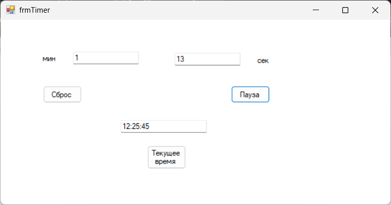

# Лабороаторная работа 6

## Описание задания:
Разработайте приложение в Visual c# «таймер» или «Секундомер«, которое
при нажатии на кнопку начинает или приостанавливает отсчет времени в
секундах.

## Цель
Целью данного урока является ознакомление с объектом Visual
c# timer, рассмотрение его свойств и метода Tick

---
### Интерфейс главной формы (Lab6)

Название проекта: `Lab6`, название файла формы `Lab6.cs`

---

### Инструментарий

| Объект              | Свойство `Name` | Свойство `Text` |
|---------------------|-----------------|-----------------|
| **Форма**           | `Lab6`  			 | frmTimer			 |
| **Текстовое поле**  | `txtSeconds`    | 0			 		 |
| **Текстовое поле**  | `txtMinutes`    | 0			 		 |
| **Текстовое поле**  | `txtNewDish`    | Now Time			 |
| **Таймер**  			 | `tmrSecundomer` | 		          |
| **Кнопка**          | `btnReset`  	 | Сброс			    |
| **Кнопка**          | `btnStart` 		 | Старт			 	 |
| **Кнопка**          | `btnShowTime`   | Tекущее время   |
---
